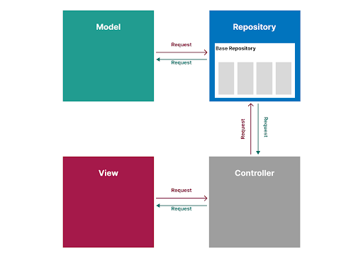

# Analyse technique 
## Technologies et outils
### adminlte

- Admin Dashboard
- Responsive Design
- Control Panel Thème

### Apache

- Serveur web
- Open Source

### Laravel

- Framework
- Architecture MVC
- i18n

### MysSQL

- un serveur de bases de données relationnelles

### PHP

- Framework
- Architecture MVC
- i18n

## design patterns repository

- Model
- View
- Controller
- Repository

## Architecture de l'application

